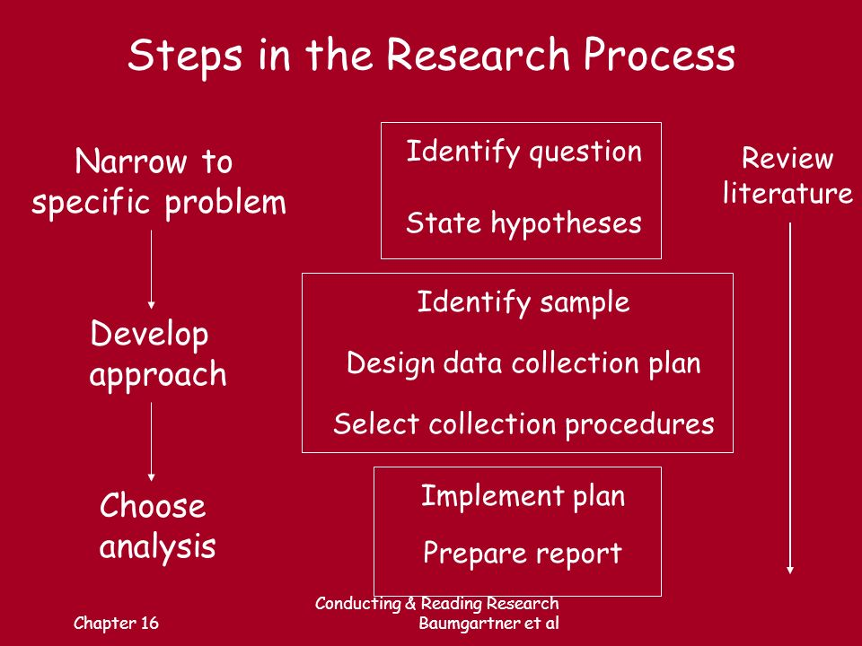
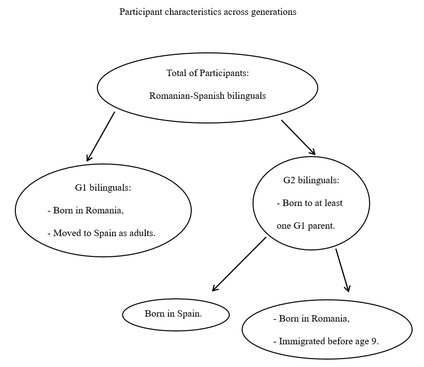

# Presentation Outline

--

- Research Idea 

--

- Background Information 

--

- Research Questions 

--

- Methodology 

 - Participants
 - Tasks

--

- Data

--

- Visualization of the Data and Analysis

--

- Results

--

- Conclusion

--

- References

---
This is what the steps for a proposal might look for many...

--

```{r, echo=FALSE, message=FALSE, warning=FALSE}


```
---

For me, it was more like this:

--

```{r, echo=FALSE, message=FALSE, warning=FALSE}
knitr::include_graphics("./Images/Gabby's Steps.PNG")

```
---
# Research Idea

--

- I wanted to:

 - relate this project to another proposal I am developing
 
 - include a sociolinguistics component

--

- Codeswitching (CS) among Romanian-Spanish bilinguals in Spain
 
--
 
 - I will look at four variables: 
 
     - Frequency of CS, 
     
     - Generation Status,
     
     - Proficiency in Romanian(1),
     
     - Gender
     
(1) I am looking only at Proficiency in Romanian to align with Torres and Potowski's (2016) methodology.
---
#Background information

--

- CS - the practice of using more than one language or language variety in discourse (Poplack, 1980)

- Although CS is a prevalent practice in bilingual communities, it falls under *nonstandardized language practices* and it is often stigmatized.

- large community of Romanians in Spain 
 -  Romanian-Spanish bilingualism is prevalent
 
- studies on Romanian-Spanish bilinguals in Spain are scarce

--

- **Labov' Gender Paradox**

 - a sociolinguistic phenomenon 
  - Women conform more closely than men to sociolinguistic norms that are overtly prescribed, but conform less than men when they are not. 
  - Women are more likely to use prestige forms and avoid stigmatized variants than men for a majority of linguistic variables, but that they are also more likely to lead language change by using innovative forms of variables.

---
#Disclaimer

--

While I acknowledge that gender is fluid, for the purposes of this proposal, I am limiting myself to traditional dichotomies of gender (male/female) in order to be able to test the predictions of the Gender Paradox.

--

More research that includes gender-non-conforming participants is highly needed!

---
#Research Questions

--

**RQ 1.** Does gender influence frequency of CS?

--

**RQ 2.** Does generation status influence frequency of CS?

--

**RQ 3.** Does proficiency in Romanian influence frequency of CS?

---
#Methodology (1)
--

## Participants

- two generations of Romanian-Spanish bilinguals 

 - Generation 1 (G1) bilinguals: born in Romania and immigrated to Spain as adults (i.e., after age 18)
 
 - Generation 2 (G2) bilinguals: born to at least one G1 parent
 
     - born in Spain
     
     - born in Romania and immigrated to Spain before age 9 (see Torres & Potowski, 2016)
     
---
 
```{r, echo=FALSE, message=FALSE, warning=FALSE}


```
---
#Methodology (2)
--

##Tasks

- In order to assess participants' CS frequency, they will take the Assessment of Code-Switching Experience Survey (ACSES; Blackburn, 2013)
 - They will be divided into *High* frequency code-switchers and *Low* frequency code-switchers

- Participants' proficiency will be assessed via the Boston Naming Test (BNT; Kaplan, Goodglass, and Weintraub, 1983) in Romanian. 
 - The BNT contains 60 outline drawings of objects and animals.
 
- Participants will also complete a **Language History Questionnaire**.

---
#Descriptive Statistics for Sample

--

```{r, echo=FALSE, message=FALSE, warning=FALSE}
library(tidyverse)
library(here)
Data<-read.csv(here("Data", "Data_Raw", "Dataset_Raw.csv"))

Descriptive<-Data %>% 
  group_by(Generation) %>%  
  summarize(Proficiency_Mean=mean(Proficiency), Proficiency_SD=sd(Proficiency),
            Proficiency_Range=range(Proficiency))

knitr::kable(head(Descriptive), format="html")
```
---
#Data (1)

--

- This is a hypothetical/simulated project, so I do not have any data collected yet.

- I simulated data in R (using the **rnorm** function.)

--

The dataset looked like this:

--

```{r, echo=FALSE, message=FALSE, warning=FALSE}
library(here)
Data<-read.csv(here("Data", "Data_Raw", "Dataset_Raw.csv"))
head(Data[1:6,])
```
--


For frequency of CS, I coded *frequent switchers* with 1 and *infrequent switchers* with 0.

---
#Data (2)

--

- The data looks like the one from the *titanic* dataset which we discussed in class.

--

- This is great news, because I can follow the steps we used in class!

--

 - generalized linear model

 - logistic regression // binomial distribution


---
#Data (3)

--

- 187 participants in total

--

.pull-left[
- 102 participants for G1

 - 41 female-identifying participants:
     - 23 - High Frequency CS
     - 18 - Low Frequency CS

 - 61 male-identifying participants:
     - 29 High Frequency CS
     - 32 Low Frequency CS
 ]
 
.pull-right[
- 85 participants for G1
 - 31 female-identifying participants:
     - 23 - High Frequency CS
     - 8 - Low Frequency CS

 - 54 male-identifying participants:
     - 42 High Frequency CS
     - 12 Low Frequency CS
]
---
#Visualization of the data

--

```{r, echo=FALSE, message=FALSE, warning=FALSE}
library(here)
Data<-read.csv(here("Data", "Data_Raw", "Dataset_Raw.csv"))
Data %>% 
  ggplot(.,aes(x=Proficiency , y = Frequency_CS, color = Gender)) +
  facet_grid(.~Generation)+
  geom_smooth(method= "glm", method.args=list(family="binomial"))
```
---
#Preliminary Analysis

--
These are the models that I am fitting.

--

- mod_null<- glm(Frequency_CS ~ 1, family= binomial(link="logit"), data = Data)

- mod_generation<-glm(Frequency_CS ~ 1 + factor(Generation), family= binomial(link="logit"), data = Data)

- mod_proficiency<- glm(Frequency_CS ~ 1 + Proficiency, family= binomial(link="logit"), data = Data)

- mod_gender<- glm(Frequency_CS ~ 1 + Proficiency + Gender, family= binomial(link="logit"), data = Data)

- mod_int<-glm(Frequency_CS ~ 1 + Proficiency*Gender,family= binomial(link="logit"), data = Data)


---
#Preliminary Results

--
```{r, echo=FALSE, message=FALSE, warning=FALSE}
library(here)
Data<-read.csv(here("Data", "Data_Raw", "Dataset_Raw.csv"))
mod_null<- glm(Frequency_CS ~ 1, family= binomial(link="logit"), data = Data)
mod_generation<-glm(Frequency_CS ~ 1 + factor(Generation), family= binomial(link="logit"), data = Data)
mod_proficiency<- glm(Frequency_CS ~ 1 + Proficiency, family= binomial(link="logit"), data = Data)
mod_gender<- glm(Frequency_CS ~ 1 + Proficiency + Gender, family= binomial(link="logit"), data = Data)
mod_int<-glm(Frequency_CS ~ 1 + Proficiency*Gender,family= binomial(link="logit"), data = Data)
anova(mod_null,mod_proficiency, mod_gender, test="Chisq")
```
---

#Conclusion

--

- It was the first time I simulated data. 

 - It was a bit challenging (and mostly frustrating at first), but overall, I really enjoyed it.

- I am working on finishing the final paper.

- Specifically, the write-up of the *Analysis* and *Results* sections.

---
#References

- Blackburn, A.M. (2013). A study of the relationship between code switching and the bilingual 
advantage: evidence that language use modulates neural indices of language processing 
and cognitive control. [Doctoral dissertation, The University of Texas at San Antonio].

- Kaplan, E., Goodglass, H., & Weintraub, S. (1983). Boston naming test. Lea & Febiger.

- Poplack, S. (1980). Sometimes I’ll start a sentence in Spanish y termino en español: Toward a typology of code-switching. Linguistics, 18, 581-618.

- Torres, L., Potowski, K. (2016). Hablamos los dos in the Windy City: Code-switching among
Puerto Ricans, Mexicans and MexiRicans in Chicago. In Guzzardo Tamargo, R. E., 
Mazak, C., & Parafita Couto, M. C. (Eds.), Spanish-English code-switching in the 
Caribbean and the US (pp. 83-105). John Benjamins.

---
class: center, middle

#Questions?

